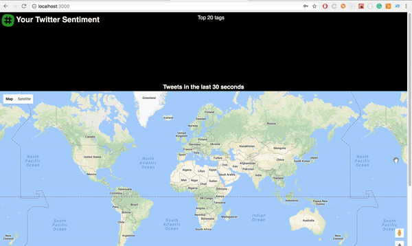
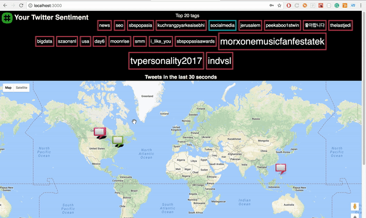
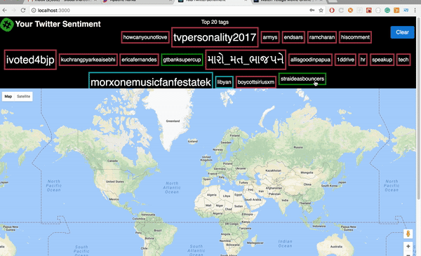
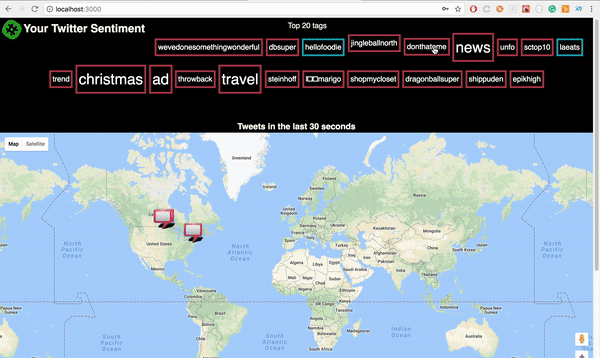

# YourTwitterSentiment
A pet project to analyze live twitter stream for the tweets sentiment and top 20 hashtags with their sentiment.
Tweets in the last 30 seconds (configuarable) are visualized on the world map with their associated sentiment and popular hashtags are visualized as a tag-cloud each tag size representing number of tweets that included the tag and its color representing the average sentiment. Tweets on map can be filtered for a specific tag from the cloud.

## Applications
This project can be used as a base for various applications like,
* Monitoring customer comments of a particular brand/service,
* Clustering different types of customers based on location, 
* General purpose usage to identify what's hot right now!
and many other use cases.

## Sentiment Analysis
Each tag is classified as either Positive, Neutral or Negative based on its tweet text. The Stanford Core_NLP library is used for classifying each tweet.

Drawback: The accuracy with core_nlp is not great. Often mis classified some obivous tweets.

Comingup: Incorporating Logistic Regression, Naive Bayes, LDA and make them configurable through UI.

## Demo

#### Sentiment by user

 

* Tweets showing the user and its tweet.

#### Sentiment by tag

* Filtering by tag gives your desired tweets on the map.

## Built With
* Apache Spark
* Apache Kafka
* Stanford Core NLP library
* React
* Redux
* Express
* Socket IO
* Node Kafka

